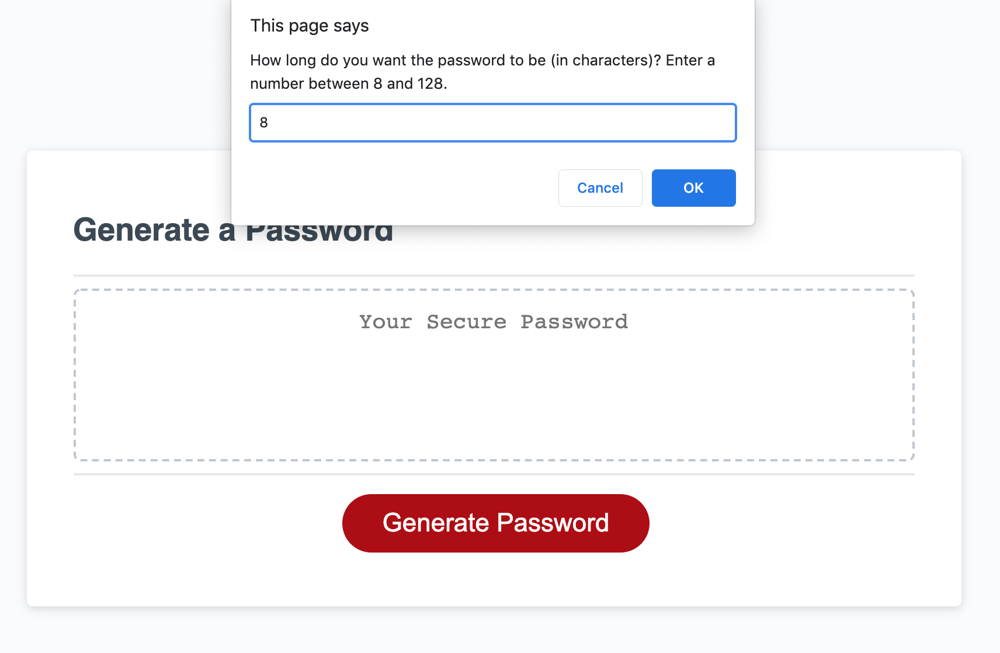

# Module 3 Challenge: Password Generator

This password generator uses Javascript to perform the following:
- Generate a random password with the option to use lowercase, uppercase, numbers and symbol characters
- The password can be made as short as 8 characters, or as long as 128 characters.
- Write the finished password on an HTML page.
- Most of the interactions are done via pop-up prompts - as shown in the screenshot below. The user can also choose to prematurely end the operation by clicking "Cancel" on the popup prompts.

